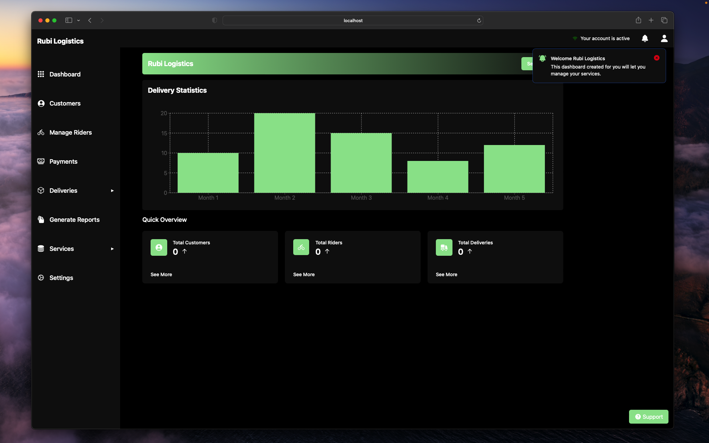

# Rubiboard

This is an open sourced version of a dashboard UI used internally at a firm I worked, directed at businesses to basically manage their logistics and riders. It would be updated routinely, since we essentially use this in prod.

## Features

1. Built on top of Vite (So it's a hella fast)
2. Uses Typescript. 
3. Uses the SWC Rust based bundler. Faster than Webpack.
4. Uses React* (Basically all client side components)
5. Preloaders.
6. React-Router-Dom
7. Animations and SVG Icons.
8. Uses rechart.
9. Tailwindcss for the entire UI.
10. Multi-step form.

## Contributions

PRs, Issues and Suggestions are highly welcome to make this project better. Also, feel free to use the template in any of your projects. By default, the entire UI too is dark.

## Contact

Shoot a mail to: Mgeraldoj07@gmail

